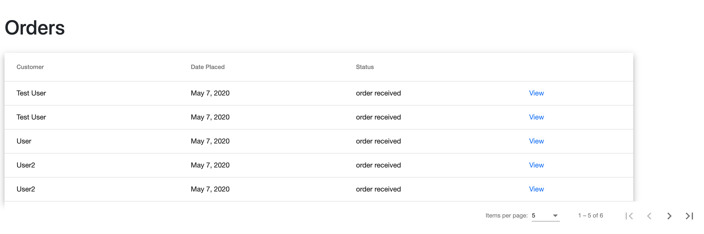

# Pets Place

It could be tough to go out and shop for our furry friends during social distancing. But with the help of Pets Place Online e-shop, we can all buy our pets their favourite treats, supplies, and toys online and get them delivered right to our doors. Enjoy shopping contact-free!

Visit us at [petsplace-demo.web.app](https://petsplace-demo.web.app)

## Technologies

This app was built with Angular, Firebase, and Bootstrap 4.

## Demo
Home Page:

Admins have a menu with more features:

Let's take a look at the order tracking module (supports sorting and pagination):

When an admin clicks on the "view" link they can post a comment and change the status of the order:

On the same page, users can comment or mark the order as completed:

Admins can also manage the product catalogue (also supports sorting by title, price, category):

Filtering products:

Add new products or update existing products instantly by filling out a product form:

User's experience while browsing through products (can filter by category):

See your orders in the shopping cart:

Submit your order after filling out a shipping form:

## Enjoy Shopping!
